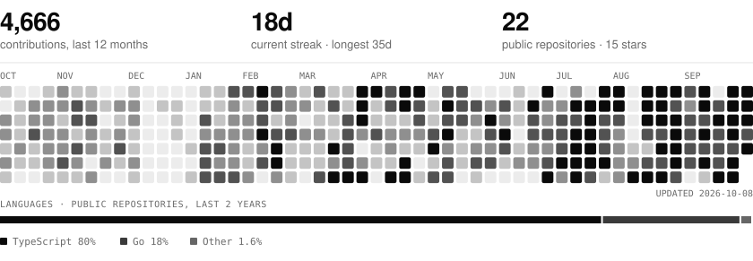

<picture>
  <source media="(prefers-color-scheme: dark)" srcset="assets/header-dark.svg">
  
</picture>

 

I build software end to end — from the data model to the deploy. Day to day that means backend services in **Go** and product surfaces in **TypeScript / Next.js**; outside of work I design and ship web apps, AI agents and automations for small businesses, running on infrastructure I operate myself.

### Selected work

**[GoShipOrSkip](https://github.com/anilonayy/shiporskip)** · [goshiporskip.com](https://goshiporskip.com)
Idea validation from real user reviews. Mines Product Hunt, Google Play, App Store and Reddit for complaints and gaps, then returns a *ship / caution / skip* verdict before a line of production code is written.
TypeScript · Next.js · LLM pipelines

**[circuitbreaker](https://github.com/anilonayy/circuitbreaker)**
A small, production-ready circuit breaker for Go. Sliding-window failure tracking, half-open probing, sensible defaults and observability hooks.
Go · library

**[jira-issue-linker](https://github.com/anilonayy/jira-issue-linker)** · [Marketplace](https://marketplace.visualstudio.com/items?itemName=anilonayy.jira-issue-linker)
VS Code extension that turns Jira keys in code into links, with status, assignee and QA on hover.
TypeScript · VS Code API

**[go-temporal-cronjobs-and-batch-processing-with-gorm](https://github.com/anilonayy/go-temporal-cronjobs-and-batch-processing-with-gorm)**
Reference project for Temporal in Go: timers, child workflows, cron schedules, signals and parallel batch activities.
Go · Temporal · GORM

**[mhrs-appointment-cli](https://github.com/anilonayy/mhrs-appointment-cli)**
Containerised CLI that watches Turkey's national hospital booking system and books the first slot matching your filters.
Go · Docker

### Toolbox

Go · TypeScript · Next.js · React · PostgreSQL · Drizzle · Temporal · Docker · Dokploy · Cloudflare · n8n · LLM agents & RAG

### Activity

<picture>
  <source media="(prefers-color-scheme: dark)" srcset="assets/activity-dark.svg">
  
</picture>

Rendered daily by a small script in this repository — no third-party widgets.

---

[anilonay.com](https://anilonay.com) · [LinkedIn](https://linkedin.com/in/cengizhan-anil-onay)
